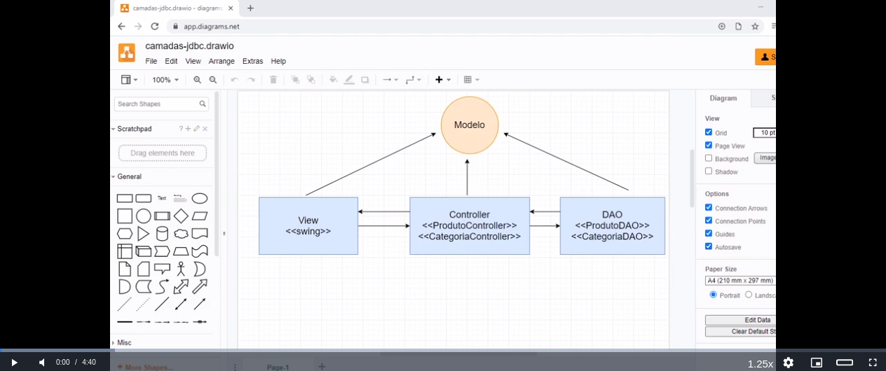
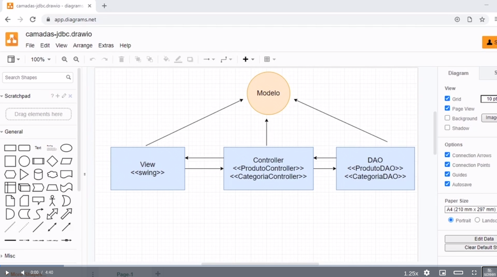

# alura-fit-screen
Extensão para o Chrome que remove as black bars dos cursos do alura.

## Antes

## Depois (pequeno botão 'fit-screen' adicionado)

## INSTALAÇÃO

1º - Entre em <a href="chrome://extensions/">Chrome Extension</a> e habilite o modo desenvolvedor.

2º - Selecione a opção "carregar descompactado".

3º - Procure onde está  a pasta "alura-fit-screen" e selecione.
